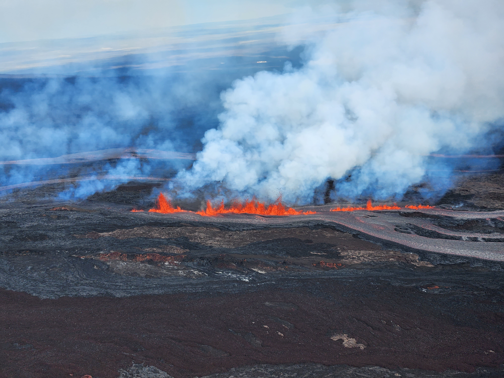
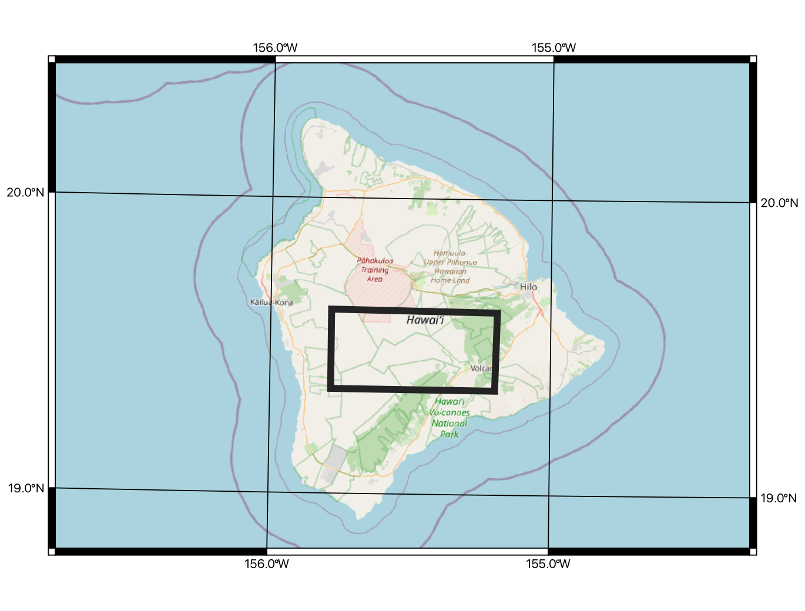
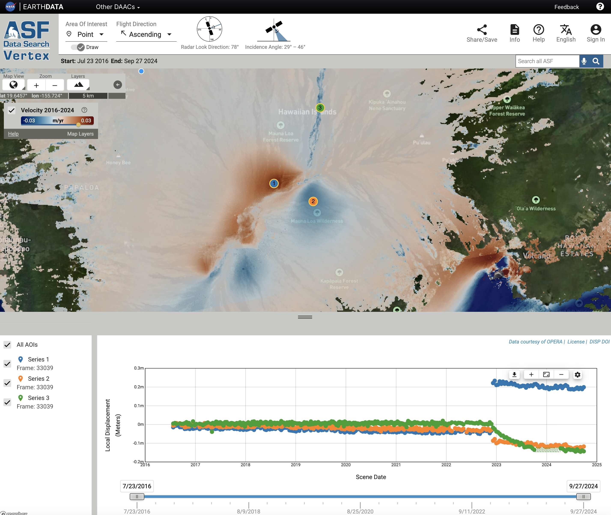
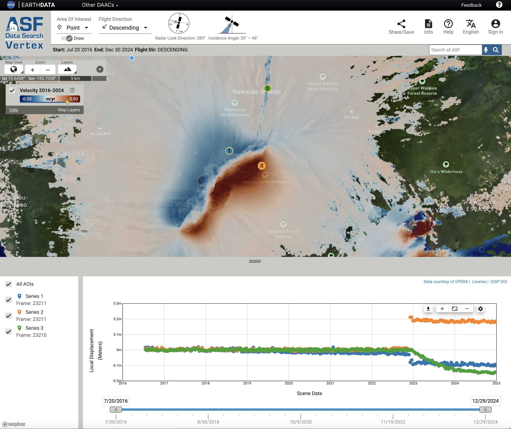

+++
author = "Eric Fielding and M. Grace Bato"
title = "Tracking Mauna Loa displacements with OPERA DISP-S1"
date = "2025-12-18"
description = "Tracking Tracking Mauna Loa displacements with OPERA DISP-S1"
+++

The OPERA Surface Displacement from Sentinel-1 (DISP-S1) products measure ground motion in the radar line-of-sight direction, providing insight into both natural and human-driven changes across Earth’s surface.

<figure>
  
  <figcaption>
    Fiery lava fountains burst from a fissure on Mauna Loa’s Northeast Rift Zone captured on November 28, 2022. <b><i>Credit: USGS Public Domain/K. Lynn.</i></b>
  </figcaption>
</figure>

Here, we highlight the application of DISP-S1 products to observe the summit area of Mauna Loa volacano in Hawai'i. Mauna Loa volcano erupted on November 27, 2022, following 38 years of repose. During the eruption onset, cracks (a.k.a fissures) tore open in the southwestern portion of the summit caldera (Moku‘āweoweo), and propagated towards the northeast, traversing the summit caldera. Additional fissures also developed toward the southern caldera and extended into the Southwest Rift Zone. 

The DISP-S1 products show the surface expression of a magma intrusion at shallow depths beneath the summit. The magma intruded along the cracks and pushed the sides of the volcano apart in a short time at the beginning of the eruption. The eruption also emplaced lava that filled the summit crater and propagated along fissures toward the southwestern part of the caldera, with additional flows advancing northward along the volcano’s flank. The lava flow shows ongoing surface displacement for almost a year after the eruption, likely a combination of slow downhill movement of the lava and contraction as the lava cools.

<figure>
  
  <figcaption>
    Map showing the location of Mauna Loa summit in the middle of the Big Island of Hawai'i, where the coverage of the two DISP-S1 maps below is shown with a black box.
  </figcaption>
</figure>

<!-- This map shows the location of Mauna Loa summit in the middle of the Big Island of Hawai'i, where the DISP-S1 maps below coverage is shown with a black box. -->

<!--  -->

<strong>Velocity Map Overviews</strong>. The two images below show velocity map views from the [Alaska Satellite Facility (ASF) Displacement Portal](https://displacement.asf.alaska.edu/#/?dispOverview=VEL&zoom=11.123&center=-155.541,19.287&flightDirs=DESCENDING&series=POINT(-155.5594093453547%2019.514142878603707)--1--Point--1b396fb4-8f31-443d-be30-03b7d25ff6c7--Series::POINT(-155.51075417202367%2019.493268696859957)--2--Point--af1bde3d-416f-470d-bad8-bedd8965c9ac--Series::POINT(-155.50216185796532%2019.602812814102023)--3--Point--b642813e-c8aa-48ba-8b4b-b3f068ff1e71--Series&start=2016-07-20T23:15:49Z&end=2024-12-30T00:16:44Z), which enables quick viewing and analysis of DISP-S1 products. We selected three points on Mauna Loa to illustrate how different parts of the volcano moved during and after the eruption in December 2022. The same three points are shown on both maps, which display DISP-S1 measurements from two Sentinel-1 tracks with opposite look directions. 

The DISP-S1 measurements are in the direction between the ground and the satellite, which is up and west (slightly south) for the ascending track but up and east (also slightly south) for the descending track. The velocity maps exhibit largely opposite patterns between the two tracks, reflecting predominantly horizontal deformation driven by magma intrusion.

For example, at Point 1 the intrusion pushed the ground to the west, which is away from the satellite (negative/blue) on the descending track and towards the satellite (positive/red) on the ascending track. Conversely, at Point 2, the intrusion pushed the ground to the east, which is positive (red) on the descending track and negative (blue) on the ascending track.

Point 3, is another feature that looks similar on the both the ascending and descending maps with a dark blue color. This is where a lava flow flowed north from one of the active fissures during the eruption. The DISP-S1 measurements show the surface of the lava flow moved away from the satellite on both tracks, so it moved down and probably a little north.

<strong>Timeseries Plots</strong>. The time series plots show the how the three points moved over time from the DISP-S1 dataset. Point 1, with blue dots on the graph, shows how the ground moved from 2016 to 2024. There is a sudden westward motion in December 2022 at the time of the Mauna Loa eruption. Point 2, with orange dots on the graph, shows how the ground moved over the same time interval, with a sudden eastward movement at the time of the eruption. 

The time series for Point 3 (green dots) has a different temporal pattern. This point is located on the surface of the emplaced lava flow that advanced northward from one of the active fissures during the eruption. The observation shows that the surface of the flow continued to moved gradually for many months after December 2022 in a direction that is away from the satellite on both tracks. This signal likely reflects a combination of the cooling and compaction of the lava flow, along with possible slow downslope motion to the north along the steep flanks of Mauna Loa.

<figure>
  
  <figcaption>
    Velocity map and time series plots for the ascending track, where the direction from the ground to the satellite is up and west.
  </figcaption>
</figure>

<figure>
  
  <figcaption>
    Velocity map and time series plots for the descending track, where the direction from the ground to the satellite is down and east.
  </figcaption>
</figure>

<!-- This is the map and time series plots for the ascending track, where the direction from the ground to the satellite is up and west.

This is the map and time series plots for the descending track, where the direction from the ground to the satellite is up and east.

 -->
 
Check this link to the Displacement Portal for the interactive map and [time series](https://displacement.asf.alaska.edu/#/?dispOverview=VEL&zoom=11.123&center=-155.541,19.287&flightDirs=DESCENDING&series=POINT(-155.5594093453547%2019.514142878603707)--1--Point--1b396fb4-8f31-443d-be30-03b7d25ff6c7--Series::POINT(-155.51075417202367%2019.493268696859957)--2--Point--af1bde3d-416f-470d-bad8-bedd8965c9ac--Series::POINT(-155.50216185796532%2019.602812814102023)--3--Point--b642813e-c8aa-48ba-8b4b-b3f068ff1e71--Series&start=2016-07-20T23:15:49Z&end=2024-12-30T00:16:44Z).

These products are available to download at [ASF Vertex](https://search.asf.alaska.edu/#/?dataset=OPERA-S1&productTypes=DISP-S1&resultsLoaded=true&zoom=8.413&center=-118.067,32.803&granule=OPERA_L3_DISP-S1_IW_F18904_VV_20240701T135248Z_20241228T135245Z_v1.0_20250418T055222Z&polygon=POINT(-118.3657%2033.7423)) or [NASA Earthdata](https://search.asf.alaska.edu/#/?dataset=OPERA-S1&productTypes=DISP-S1&resultsLoaded=true&zoom=8.413&center=-118.067,32.803&granule=OPERA_L3_DISP-S1_IW_F18904_VV_20240701T135248Z_20241228T135245Z_v1.0_20250418T055222Z&polygon=POINT(-118.3657%2033.7423)).
